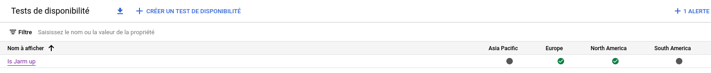
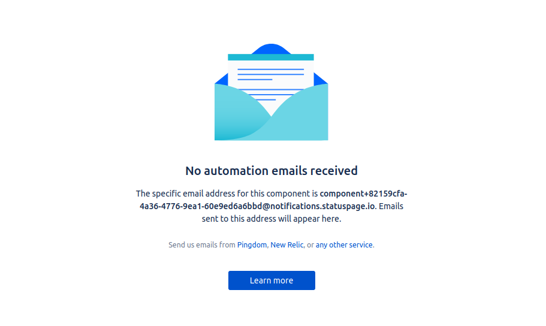
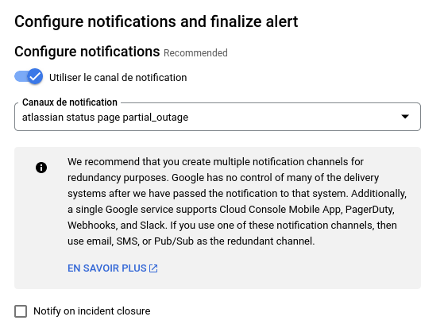
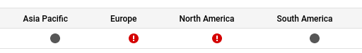
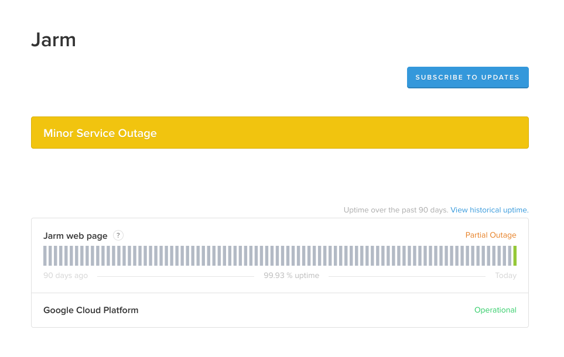

# Set up a free semi-automated status page
  

For this we'll use [GCP](cloud.google.com) for monitoring and [Atlassian status page](statuspage.io).  
This is the software used by [PyPi](https://status.python.org/) and [Dropbox](https://status.dropbox.com/) among others !

## GCP ping

Go to https://console.cloud.google.com/monitoring/uptime/
and create a new monitoring, three zones are required at least.
Select an interval, I recommend using 1 minute while testing and then switch to 15mins.
> Pricing wise, the [first million ping is free](https://cloud.google.com/stackdriver/pricing).  
> In our case, it means we'll only ping 4 times per hour from 3 location, so 730 * 4 * 3 = 8,760.  
> We are thus well below the allotement.  

For the alert, you can set up your email address, we'll add another alert for statuspage later.  
If done properly it should looks like:

## Statuspage

Create a free account in statuspage.io

> The free account is [very generous](https://www.atlassian.com/software/statuspage/pricing) in this case too.
> We'll use only one or two components of the 25 alloted.

In the components tab, remove the examples and create a new component. Once created, click on `Automation`.  
There, note down the email address. 

Of course the address should be kept private and can be regenarated as needed.  
Out of the box, this address requires specific email subject (**UP**/**DOWN**) GCP do not offer.  
So we'll use the trick described in [statuspage documentation](https://support.atlassian.com/statuspage/docs/get-started-with-email-automation/) that consists of adding a suffix to the address.  
Therefore we'll add `+partial_outage` to the email address.  

## Connecting the two
For linking GCP with statuspage, go to the [manage notification page](https://console.cloud.google.com/monitoring/alerting/notifications) and add the email address with the suffix.  
Then edit the uptime monitoring to add an alert using this new notification canal. By default, GCP will send an email on monitoring detecting down service and when it goes up again.  
On the statuspage email we only want the former. So uncheck the *Notify on incident closure* box:

## Testing time

If you are at the liberty to bring your system down, now is the time to do so 💥. Else you can simply move the monitoring target to a host not responding.  
If everything is set up correctly, you should see GCP monitoring in RED:
  
And the status page reacting accordingly ✨:  

## Going further
Sadly the email suffix method can't be used to put a component in the UP state. This is why this method is "semi-automated" as it require a manual action to set it back to normal.  
A way to explore is to set up a webhook hitting statuspage [API](https://developer.statuspage.io/#operation/patchPagesPageIdComponentsComponentId).  
The free tier also offer 2 metrics, so API response time and/or traffic can be shown there.